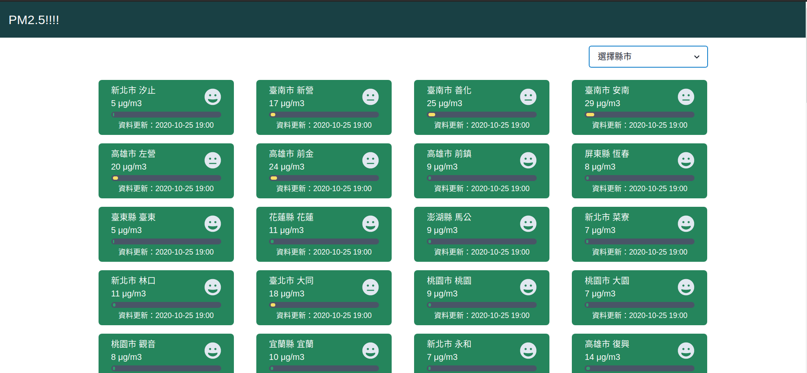
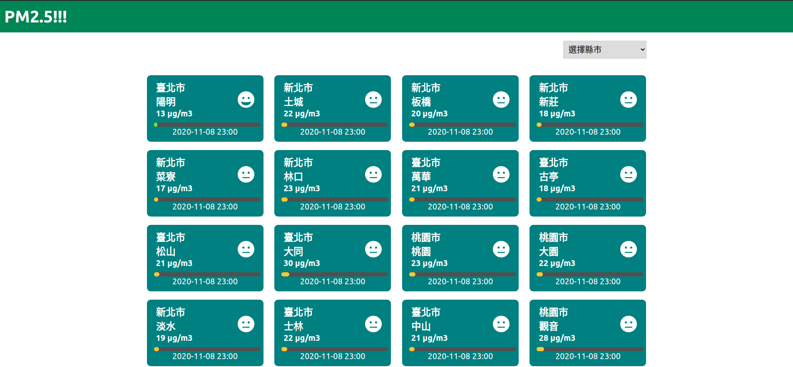

## Taiwan PM2.5 project example

using React and Svelte frameworks

using golang create a simple server

### React

### Svelte


*** 
step1 get token 
[https://data.epa.gov.tw/](https://data.epa.gov.tw/)
```go
const Token = "<your token>"
```

step2 run server
```
go run main.go
```

run React 
```
cd React
npm install
npm run start
```

run Svelte 
```
cd Svelte 
npm install
npm run dev
```